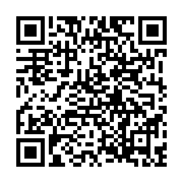
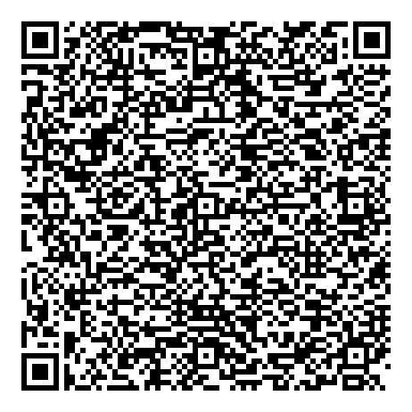
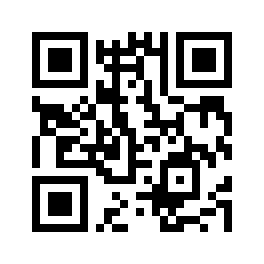

# Buy me a coffee ☕

FAV is free and open source. It has no ads, tracking or paid features.

Building, testing and publishing it still takes time and money. Apple's
Developer Program alone costs $99 a year 🍎.

If FAV has been useful and you feel like buying me a coffee, thank you. It is
entirely optional and changes nothing in the app 💜.

Starring the repository also helps ⭐.

## Bitcoin (on-chain)

I can't really picture anyone donating an amount large enough to make the
on-chain fees worth it — but if you happen to be that wonderfully generous
person, get in touch at [fav-contact.elastic936@slmail.me](mailto:fav-contact.elastic936@slmail.me)
and I'll gladly send you an address.

## Lightning Address

Works with most Lightning wallets (Wallet of Satoshi, Blink, Phoenix, …):

`snazzygoat610@walletofsatoshi.com`



## Lightning (BOLT12 offer)

For wallets that support BOLT12 (e.g. Phoenix):

```
lno1pg25vs2kypqhqupqv3hkuct5d9hkug8sn7ff2y8wqwryaup9lh50kkranzgcdnn2fgvx390wgj5jd07rwr3vxeje0glc7q7fkvw7hwulscv946s28uxr68ntk9wgmfdcwqz0guktac5x86r5lypq8zkkxw7g3efwjm53ttnd9ycgung0mn3984ut02040j7ys4y8sqdgqqel4u96vf8v4cr4scen39s79tv2ll5a8tl6smpark6s96tghzekglezwx7uc5252st5paxtjhxed3l6avnesq36rf37y3qhqd8tj2e450j6csl266gr7vcnm2jjyd2025fetldc7uqryhym0d2dc86m6832qf3fevrqwuuam8pcvmqk4phzm6t0ganggf4wa2m5j9qv9yqpywctq90xugy9vp8d5
```



## PayPal

<https://paypal.me/kasbrut>



---

Thank you 💜
